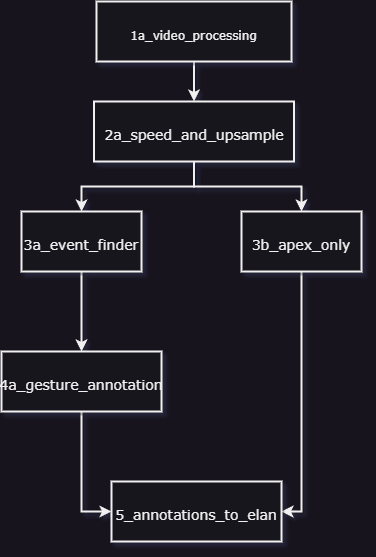

# Automatic Gesture Annotation Repository

The goal of this repository is to guide users through using the process of automatic gesture annotation.

## Installation Instructions

To begin installation, either clone the repository or download as a zip and place in desired directory.

```shell
    git clone https://github.com/walterdych/Co-Speech-Gesture-Automation
```

You will also need to install the required packages for this repository. A requirements list has been provided, simply run the following command:

```shell
    pip install -r requirements.txt
```

Also provided is a list of the packages utilized by this repo:

* `opencv-python-headless`
* `matplotlib`
* `mediapipe`
* `numpy`
* `pandas`
* `plotly`
* `scipy`
* `scikit-learn`

## Working through the Repository

The repository is straightforward and flexible and designed to where the only parameters needing change should be the specific locations and articulators of interest.  

<div align=center>
    
</div>
